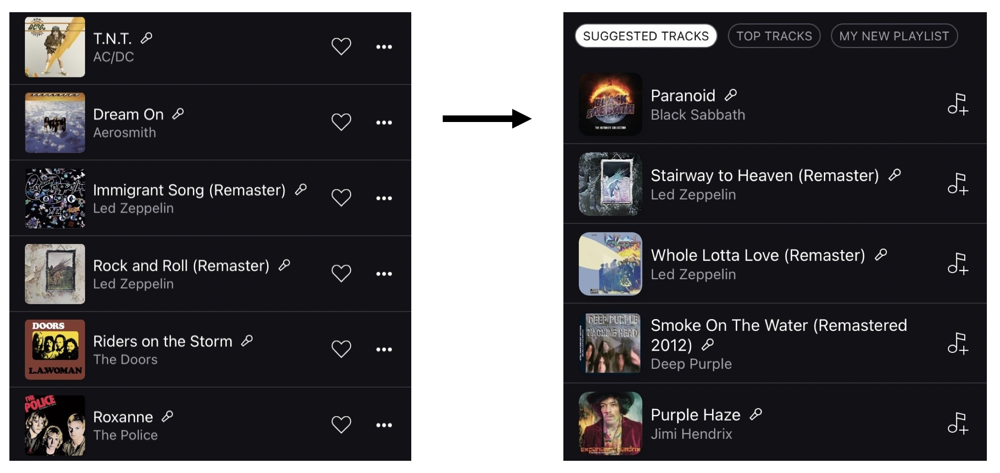
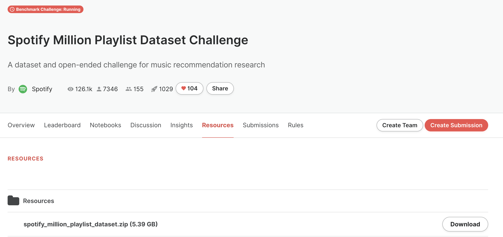

# Pipeline of Automatic Playlist Continuation

## Automatic Playlist Continuation at Scale


Music streaming services often aim to recommend songs for users to extend the playlists they have created on these services. However, extending playlists while preserving their musical characteristics and matching user preferences remains a challenging task, commonly referred to as **Automatic Playlist Continuation (APC)**. 


In the pipeline, we demonstrate the relevance of our framework through an in-depth experimental validation:
* Firstly, we provide **offline experiments** on Spotify's **Million Playlist Dataset (MPD)**, i.e., the largest public dataset for APC. This repository aims to facilitate the reproducibility of these experiments.

<p align="center">
  
</p>


## Installation

### Code

```
git clone https://github.com/ccloud98/Pipeline
cd Pipeline
pip install -r requirements.txt
```

Requirements: implicit==0.6.1, matplotlib==3.6.2, pandas==1.5.2, psutil==5.9.4, pympler==1.0.1, scipy==1.7.3, seaborn==0.12.1, tables==3.7.0, tqdm==4.64.1.

### Data

Please download Spotify's Million Playlist Dataset (MPD) on [AIcrowd.com](https://www.aicrowd.com/challenges/spotify-million-playlist-dataset-challenge).

You would need to create an account and register to the challenge to do so.

<p align="center">
  
</p>

Then, please unzip all files in a single folder, for instance: `resources/data/raw_MPD`.

Run the following script to pre-process and format the MPD (expected time: around 1 hour on a regular laptop).

```
python src/format_baseline_input.py --mpd_path resources/data/raw_MPD --out_path resources/data/baseline_input
```


## Run Experiments


### Train and evaluate baselines

Format the MPD to comply with baseline models:

```
python -m src.format_baseline_input --mpd_path /PATH/TO/UNZIPPED/MPD
```

Train the **MUSE** model from the paper:

```
python -m run_baselines --model_name MUSE
```

After training, baseline models can be saved as a numpy file and evaluated using a script.
```
python load_recommendations.py
```

